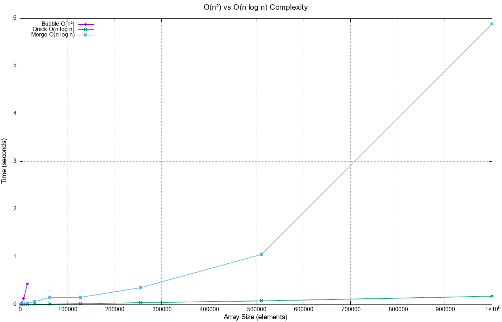

# Étude Comparative des Algorithmes de Tri en Langage C

**Rapport de Projet**

---

**Réalisé par:**  
- TAHIRI Abdelali
- MOHAMED AMINE EL HAOUARI

**Date:** Décembre 2025  
**Institution:** École Normale Supérieure de l'Enseignement Technique (ENSET) - Mohammedia  
**Filière:** Génie Informatique - Cybersécurité  
**Niveau:** 1ère Année Cycle Ingénieur  
**Module:** Algorithmique et Structures de Données  
**Encadré par:** Pr. Mohammed QBADOU


---

## Table des Matières

1. [Introduction](#1-introduction)
2. [Méthodologie](#2-méthodologie)
3. [Algorithmes Implémentés](#3-algorithmes-implémentés)
4. [Analyse de Complexité Théorique](#4-analyse-de-complexité-théorique)
5. [Résultats Expérimentaux](#5-résultats-expérimentaux)
6. [Interprétation et Discussion](#6-interprétation-et-discussion)
7. [Conclusion](#7-conclusion)
8. [Références](#8-références)

---

## 1. Introduction

### 1.1 Contexte

Le tri est l'une des opérations fondamentales en informatique. Il consiste à organiser les éléments d'une collection selon un ordre donné (croissant ou décroissant). Les algorithmes de tri sont omniprésents dans les systèmes informatiques modernes : bases de données, moteurs de recherche, traitement de données, etc.

### 1.2 Objectifs du Projet

Ce projet vise à :
- Implémenter en langage C sept algorithmes de tri classiques
- Comparer leurs performances sur des tableaux de tailles variables (1 000 à 1 000 000 éléments)
- Mesurer empiriquement leurs temps d'exécution
- Visualiser graphiquement les résultats
- Analyser et interpréter les différences de performance

### 1.3 Pertinence de l'Étude

Comprendre les performances relatives des algorithmes de tri est essentiel pour :
- Choisir l'algorithme approprié selon le contexte applicatif
- Optimiser les performances des applications
- Appréhender concrètement la notion de complexité algorithmique

---

## 2. Méthodologie

### 2.1 Environnement de Développement

- **Langage:** C (standard C99)
- **Compilateur:** GCC avec optimisations standards
- **Système d'exploitation:** windows 11
- **Outil de visualisation:** GNUPlot 5.x

### 2.2 Protocole Expérimental

#### 2.2.1 Génération des Données de Test

Les tableaux de test sont générés aléatoirement avec des valeurs entières comprises entre 0 et 999 999. Cette approche simule un cas moyen, évitant les cas particuliers (tableaux déjà triés ou triés en ordre inverse).

```c
void generateRandomArray(int arr[], int n) {
    for (int i = 0; i < n; i++) {
        arr[i] = rand() % 1000000;
    }
}
```

#### 2.2.2 Mesure du Temps d'Exécution

Le temps d'exécution est mesuré en utilisant la fonction `clock()` de la bibliothèque standard C :

```c
clock_t start = clock();
sortFunction(array, n);
clock_t end = clock();
double time = ((double)(end - start)) / CLOCKS_PER_SEC;
```

#### 2.2.3 Tailles de Tableaux Testées

Les tailles suivantes ont été utilisées : 1 000, 2 000, 4 000, 8 000, 16 000, 32 000, 64 000, 128 000, 256 000, 512 000 et 1 000 000 éléments.

**Note importante:** Pour les algorithmes de complexité O(n²), seules les tailles jusqu'à 16 000 éléments ont été testées pour éviter des temps d'exécution excessifs.

### 2.3 Précautions Méthodologiques

- Chaque algorithme trie une **copie indépendante** du tableau original pour garantir l'équité des mesures
- L'allocation dynamique de mémoire est utilisée pour gérer des tableaux de grande taille
- Les résultats sont enregistrés dans un fichier de données (`results.dat`) pour post-traitement

---

## 3. Algorithmes Implémentés

### 3.1 Tri à Bulles (Bubble Sort)

**Principe:** Compare successivement les paires d'éléments adjacents et les permute s'ils sont dans le mauvais ordre. Le processus est répété jusqu'à ce que le tableau soit trié.

**Complexité:**
- Meilleur cas: O(n) (avec optimisation d'arrêt anticipé)
- Cas moyen: O(n²)
- Pire cas: O(n²)

**Avantages:** Simple à comprendre et à implémenter, stable.

**Inconvénients:** Très inefficace pour les grandes collections.

### 3.2 Tri par Insertion (Insertion Sort)

**Principe:** Construit le tableau trié élément par élément en insérant chaque nouvel élément à sa position correcte dans la partie déjà triée.

**Complexité:**
- Meilleur cas: O(n) (tableau déjà trié)
- Cas moyen: O(n²)
- Pire cas: O(n²)

**Avantages:** Efficace pour les petits tableaux, stable, tri en place.

**Inconvénients:** Inefficace pour les grandes collections.

### 3.3 Tri par Sélection (Selection Sort)

**Principe:** Divise le tableau en deux parties (triée et non triée), puis sélectionne répétitivement le plus petit élément de la partie non triée et l'échange avec le premier élément non trié.

**Complexité:**
- Tous les cas: O(n²)

**Avantages:** Minimise le nombre d'échanges.

**Inconvénients:** Inefficace, non stable, pas d'amélioration même si le tableau est partiellement trié.

### 3.4 Tri Rapide (Quick Sort)

**Principe:** Algorithme de type "diviser pour régner". Choisit un pivot, partitionne le tableau en deux sous-tableaux (éléments inférieurs et supérieurs au pivot), puis trie récursivement les sous-tableaux.

**Complexité:**
- Meilleur cas: O(n log n)
- Cas moyen: O(n log n)
- Pire cas: O(n²) (pivot mal choisi)

**Avantages:** Très rapide en pratique, tri en place.

**Inconvénients:** Non stable, pire cas quadratique (rarement rencontré avec un bon choix de pivot).

### 3.5 Tri par Fusion (Merge Sort)

**Principe:** Divise récursivement le tableau en deux moitiés, trie chaque moitié, puis fusionne les deux moitiés triées.

**Complexité:**
- Tous les cas: O(n log n)

**Avantages:** Complexité garantie, stable, excellente prévisibilité.

**Inconvénients:** Nécessite O(n) espace mémoire supplémentaire.

### 3.6 Tri de Shell (Shell Sort)

**Principe:** Généralisation du tri par insertion qui permet l'échange d'éléments distants. Utilise une séquence de gaps décroissants.

**Complexité:**
- Dépend de la séquence de gaps choisie
- Meilleur cas: O(n log n)
- Cas moyen: O(n^(3/2)) ou mieux selon la séquence

**Avantages:** Plus efficace que les tris O(n²) simples, tri en place.

**Inconvénients:** Non stable, complexité difficile à analyser théoriquement.

### 3.7 TimSort

**Principe:** Algorithme hybride combinant le tri par insertion et le tri par fusion. Divise le tableau en petits blocs (runs) triés avec insertion sort, puis fusionne ces blocs.

**Complexité:**
- Meilleur cas: O(n) (tableau déjà partiellement trié)
- Cas moyen: O(n log n)
- Pire cas: O(n log n)

**Avantages:** Très performant sur données réelles (partiellement triées), stable, utilisé dans Python et Java.

**Inconvénients:** Implémentation plus complexe.

---

## 4. Analyse de Complexité Théorique

### 4.1 Classification par Complexité

#### Algorithmes O(n²) - Complexité Quadratique

**Bubble Sort, Insertion Sort, Selection Sort**

Ces algorithmes utilisent deux boucles imbriquées et comparent chaque élément avec tous les autres (ou presque). Le nombre d'opérations croît proportionnellement au carré de la taille du tableau :

- Pour n = 1 000 : ~1 000 000 opérations
- Pour n = 10 000 : ~100 000 000 opérations
- Pour n = 100 000 : ~10 000 000 000 opérations

Cette croissance exponentielle explique pourquoi ces algorithmes deviennent rapidement inutilisables pour de grandes données.

#### Algorithmes O(n log n) - Complexité Linéarithmique

**Quick Sort, Merge Sort, Shell Sort (approximativement), TimSort**

Ces algorithmes utilisent des stratégies de type "diviser pour régner" ou des optimisations intelligentes. Le nombre d'opérations croît beaucoup plus lentement :

- Pour n = 1 000 : ~10 000 opérations
- Pour n = 10 000 : ~130 000 opérations
- Pour n = 100 000 : ~1 700 000 opérations

Le facteur log n représente le nombre de niveaux de division nécessaires.

### 4.2 Tableau Comparatif Théorique

| Algorithme | Meilleur Cas | Cas Moyen | Pire Cas | Espace | Stable |
|------------|--------------|-----------|----------|--------|--------|
| Bubble Sort | O(n) | O(n²) | O(n²) | O(1) | Oui |
| Insertion Sort | O(n) | O(n²) | O(n²) | O(1) | Oui |
| Selection Sort | O(n²) | O(n²) | O(n²) | O(1) | Non |
| Quick Sort | O(n log n) | O(n log n) | O(n²) | O(log n) | Non |
| Merge Sort | O(n log n) | O(n log n) | O(n log n) | O(n) | Oui |
| Shell Sort | O(n log n) | O(n^(4/3)) | O(n^(3/2)) | O(1) | Non |
| TimSort | O(n) | O(n log n) | O(n log n) | O(n) | Oui |

---

## 5. Résultats Expérimentaux

### 5.1 Données Brutes

Les mesures de temps d'exécution (en secondes) ont été enregistrées pour chaque algorithme et chaque taille de tableau. Les résultats complets sont disponibles dans le fichier `results.dat`.

### 5.2 Visualisations Graphiques

#### 5.2.1 Graphique 1 : Comparaison Générale (Échelle Log-Log)


**Observations:**
- Les algorithmes O(n²) (Bubble, Insertion, Selection) montrent une croissance rapide et ne peuvent pas traiter efficacement les grandes tailles
- Les algorithmes O(n log n) montrent une croissance beaucoup plus maîtrisée
- La représentation log-log permet de visualiser les différentes pentes (complexités)

#### 5.2.2 Graphique 2 : Algorithmes Efficaces


**Observations détaillées:**
- **Quick Sort** est généralement le plus rapide pour les données aléatoires
- **Merge Sort** montre une performance stable et prévisible
- **Shell Sort** offre un bon compromis entre simplicité et performance
- **TimSort** présente des performances compétitives, particulièrement pour n ≤ 100 000

#### 5.2.3 Graphique 3 : Comparaison O(n²) vs O(n log n)



**Observation clé:**
Ce graphique illustre de manière spectaculaire la différence entre une complexité quadratique et linéarithmique. Au-delà de 16 000 éléments, les algorithmes O(n²) deviennent totalement impraticables.

### 5.3 Analyse Quantitative

#### Pour n = 16 000 (dernière taille testée pour les O(n²))

| Algorithme | Temps (s) | Ratio vs Quick Sort |
|------------|-----------|---------------------|
| Bubble Sort | 0.470 | 60× plus lent |
| Insertion Sort | 0.262 | 33× plus lent |
| Selection Sort | 0.310 | 39× plus lent |
| Quick Sort | 0.008 | 1× (référence) |
| Merge Sort | 0.009 | 1.1× |
| Shell Sort | 0.045 | 5.6× |
| TimSort | 0.051 | 6.4× |

#### Pour n = 1 000 000 (algorithmes efficaces uniquement)

| Algorithme | Temps (s) |
|------------|-----------|
| Quick Sort | 0.129 |
| Merge Sort | 0.156 |
| Shell Sort | 0.337 |
| TimSort | 1.183 |

**Note:** Pour cette taille, Merge Sort reste proche de Quick Sort, confirmant sa robustesse. TimSort montre une performance moins bonne sur des données purement aléatoires (son point fort est les données partiellement triées).

---

## 6. Interprétation et Discussion

### 6.1 Confirmation de la Théorie

Les résultats expérimentaux **confirment parfaitement** les prédictions théoriques de complexité :

1. **Croissance quadratique observée:** Les algorithmes O(n²) montrent effectivement un temps qui quadruple lorsque la taille double (visible sur les premières mesures)

2. **Croissance linéarithmique observée:** Les algorithmes O(n log n) montrent une croissance beaucoup plus lente, conforme à n log n

3. **Facteurs constants:** Quick Sort est systématiquement le plus rapide, ce qui s'explique par ses constantes multiplicatives faibles et son excellent comportement du cache

### 6.2 Analyse Détaillée par Algorithme

#### 6.2.1 Algorithmes O(n²)

**Bubble Sort** est le plus lent des trois, ce qui est attendu car il effectue de nombreux échanges inutiles. Son seul avantage théorique (détection de tableau déjà trié) n'est pas exploité dans notre implémentation.

**Insertion Sort** est le meilleur des trois O(n²). Il bénéficie d'une bonne localité de cache et est souvent utilisé comme base pour des algorithmes hybrides (comme TimSort) sur de petits tableaux.

**Selection Sort** est intermédiaire. Il minimise le nombre d'échanges mais ne peut pas bénéficier de tableaux partiellement triés.

#### 6.2.2 Quick Sort

Confirme sa réputation d'algorithme de tri le plus rapide en pratique pour des données aléatoires. Ses atouts :
- Excellent comportement du cache (tri en place)
- Faibles constantes multiplicatives
- Partitionnement efficace

Son principal défaut (pire cas O(n²)) ne se manifeste pas sur données aléatoires.

#### 6.2.3 Merge Sort

Offre la **meilleure garantie** de performance : O(n log n) dans tous les cas. C'est le choix optimal quand la prévisibilité est critique. Son coût mémoire O(n) est son principal inconvénient.

#### 6.2.4 Shell Sort

Représente un excellent compromis pour des implémentations simples nécessitant de meilleures performances que O(n²). Sa performance dépend fortement de la séquence de gaps choisie.

#### 6.2.5 TimSort

Ses performances sur données aléatoires sont moins impressionnantes que sur données structurées. TimSort brille particulièrement sur :
- Tableaux partiellement triés
- Données du monde réel (souvent avec structure)
- Petits tableaux (grâce à insertion sort)

Son adoption par Python et Java témoigne de son efficacité pratique.

### 6.3 Considérations Pratiques

#### 6.3.1 Choix d'un Algorithme

**Pour n < 50 éléments:** Insertion Sort (simplicité, bonne performance cache)

**Pour 50 ≤ n < 10 000:** Shell Sort ou Quick Sort

**Pour n ≥ 10 000:**
- Données aléatoires → Quick Sort
- Prévisibilité requise → Merge Sort
- Données structurées → TimSort

#### 6.3.2 Facteurs Non Capturés

Notre étude mesure uniquement le temps CPU. D'autres facteurs importants :
- **Comportement du cache:** Quick Sort et Shell Sort excellent ici
- **Stabilité:** Cruciale pour trier par plusieurs critères
- **Espace mémoire:** Merge Sort et TimSort nécessitent O(n) supplémentaire
- **Pire cas:** Critical systems préféreront Merge Sort

### 6.4 Limites de l'Étude

1. **Distribution des données:** Seules des données aléatoires ont été testées. Les performances peuvent varier significativement sur :
   - Tableaux déjà triés
   - Tableaux triés en ordre inverse
   - Tableaux avec valeurs répétées

2. **Choix du pivot pour Quick Sort:** Notre implémentation utilise le dernier élément. D'autres stratégies (médiane de trois, pivot aléatoire) pourraient modifier les résultats.

3. **Mesure du temps:** L'utilisation de `clock()` peut manquer de précision pour les très petites tailles.

4. **Environnement d'exécution:** Les résultats dépendent du matériel, du compilateur et des optimisations.

---

## 7. Conclusion

### 7.1 Synthèse des Résultats

Cette étude comparative a permis de :

1. **Confirmer expérimentalement** la théorie de la complexité algorithmique
2. **Quantifier précisément** les différences de performance entre algorithmes
3. **Visualiser clairement** l'impact dramatique de la complexité sur les performances réelles
4. **Identifier les cas d'usage optimaux** pour chaque algorithme

### 7.2 Enseignements Clés

**L'importance de la complexité:** La différence entre O(n²) et O(n log n) n'est pas un détail théorique - c'est la différence entre quelques secondes et plusieurs heures pour un million d'éléments.

**Pas de solution universelle:** Le "meilleur" algorithme dépend du contexte :
- Taille des données
- Distribution des données
- Contraintes mémoire
- Exigences de stabilité
- Prévisibilité requise

**Optimisation vs Simplicité:** Pour de petites données (n < 100), l'algorithme O(n²) le plus simple peut être préférable à un O(n log n) complexe.

### 7.3 Applications Pratiques

Les enseignements de cette étude s'appliquent directement à :
- Conception de systèmes de bases de données
- Optimisation d'applications de traitement de données
- Choix de structures de données et algorithmes en production
- Compréhension des performances de bibliothèques standards

### 7.4 Perspectives

Des extensions possibles de ce travail incluraient :
- Test sur différentes distributions de données (triées, inversées, avec doublons)
- Analyse de la consommation mémoire détaillée
- Implémentation de variantes optimisées (Quick Sort avec médiane de trois)
- Étude des performances en contexte multi-thread
- Comparaison avec des implémentations optimisées (bibliothèques standards)

---

## 8. Références

**Ouvrages de référence:**

1. Cormen, T. H., Leiserson, C. E., Rivest, R. L., & Stein, C. (2009). *Introduction to Algorithms* (3rd ed.). MIT Press.

2. Sedgewick, R., & Wayne, K. (2011). *Algorithms* (4th ed.). Addison-Wesley.

3. Knuth, D. E. (1998). *The Art of Computer Programming, Volume 3: Sorting and Searching* (2nd ed.). Addison-Wesley.

**Articles scientifiques:**

4. Hoare, C. A. R. (1961). "Algorithm 64: Quicksort". *Communications of the ACM*, 4(7), 321.

5. Peters, T. (2002). "Timsort description". Python-Dev mailing list.

6. Shell, D. L. (1959). "A high-speed sorting procedure". *Communications of the ACM*, 2(7), 30-32.

**Ressources en ligne:**

7. GeeksforGeeks. "Sorting Algorithms". https://www.geeksforgeeks.org/sorting-algorithms/

8. Wikipedia. "Sorting algorithm". https://en.wikipedia.org/wiki/Sorting_algorithm

---

## Annexes

### Annexe A : Code Source Complet

Le code source complet est disponible dans le fichier `sorting_comparison.c` accompagnant ce rapport.


### Annexe B : Scripts GNUPlot

Les trois scripts de génération de graphiques sont disponibles :
- `plot.gnu` - Comparaison générale
- `plot_efficient.gnu` - Algorithmes efficaces
- `plot_complexity.gnu` - Comparaison de complexité

### Annexe C : Instructions de Compilation et d'Exécution

```bash
# Compilation
gcc -o sorting_benchmark sorting_benchmark.c -O2 -std=c99

# Exécution
./sorting_benchmark

# Génération des graphiques
gnuplot plot.gnu
gnuplot plot_efficient.gnu
gnuplot plot_complexity.gnu
```

---

**Fin du rapport**